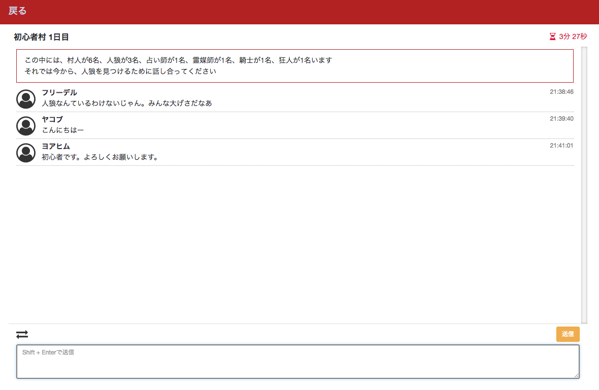
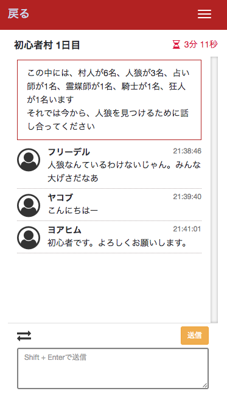

# Jinro Rails
Jinro Rails is the open source werewolf game application.
You can play the werewolf game with chat.

## Screenshots



## Built with
Jinro Rails is built with following libraries.

- Ruby
- Ruby on Rails
- Vue.js
- MySQL

## Development
To develop Jinro Rails, you should run servers of Ruby on Rails and Webpack.

```
$ git clone https://github.com/fshin1988/jinro_rails.git
$ cd jinro_rails
$ bin/setup
$ bin/rails s
$ bin/webpack-dev-server
```

To update the application you just run `bin/update`.

## Contributing
Bug reports and pull requests are welcome on GitHub at https://github.com/fshin1988/jinro_rails

## License
The application is available as open source under the terms of the [MIT License](http://opensource.org/licenses/MIT).
